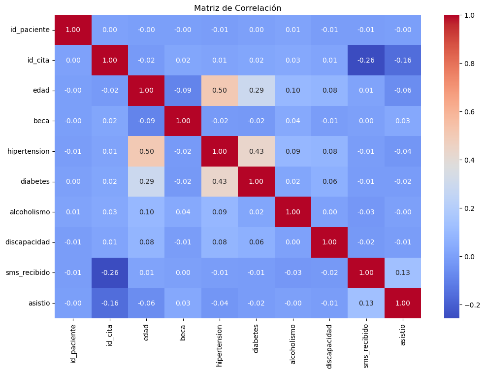
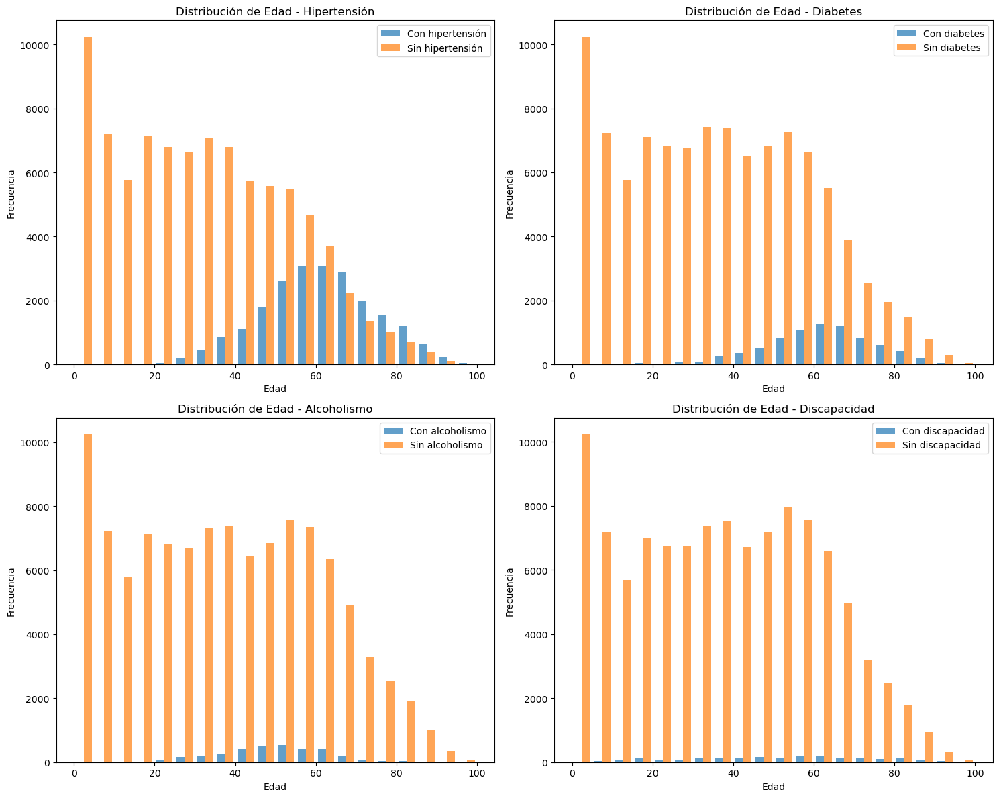

# 📌 <GESTOR_DE_REGISTROS_MÉDICOS_SIMPLIFICADO>

*Curso:* Samsung Innovation Campus – Módulo de Python (Ecuador 2025)  
*Seccion:* <ecuador04>  
*Carpeta:* /ecuador04>/<GESTOR DE REGISTROS MÉDICOS SIMPLIFICADO>

---

## 👥 Integrantes del Grupo
- Joseph Granja 
- Pablo Cardenas 
- Bryan Robalino
- Mateo Chalacan 
- Javier Bravo

---

## 📝 Descripción del Proyecto
Este proyecto aborda la dificultad que enfrentan consultorios y clínicas pequeñas para organizar la información de sus pacientes. el objetivo principal es ofrecer una herramienta sencilla para registrar y consultar citas, diagnósticos y tratamientos. Está dirigido a médicos y personal de salud facilitando la atención al paciente y reduciendo errores en la gestión manual de datos.

---

## ⚙ Instrucciones de Instalación y Ejecución

### Requisitos
- Python 1.13.5
- Git

### Pasos
1. Clonar el repositorio (o asegurarse de estar en la carpeta del proyecto):
   bash
   git clone <URL_DEL_REPO>
   cd <ruta/al/proyecto>   # ej: cd ecuador03/proyecto-01-nombre
   

2. Actualizar pip e instalar dependencias:
   bash
   pip install --upgrade pip
   pip install -r requirements.txt
   

3. Ejecutar la aplicación (ejemplo):
   bash
   python main.py

4. Ejecutar pruebas (si aplica):
   bash
   pytest
   

---

## 📂 Estructura del Código

```bash
GESTOR-DE-REGISTROS-MEDICOS-SIMPLIFICADO/
│
├── main.py               # Punto de entrada principal
├── README.md             # Este archivo (personalizar)
├── requirements.txt      # Dependencias del proyecto
├── KaggleV2-May-2016.csv                 # Datos de ejemplo 
├── Datos_Procesados/                  # Datos limpios y procesados 
│   └── datos_procesados.csv
├── Estadisticas/                 # Estadisticas para trabajar con los graficos
│   ├── estadisticas_pacientes.ipnyb
│   └── statistics.txt
├── graficos/                 # Graficos generados 
│   ├── correlacion.png
│   ├── distribucion_edades_condicion_medica.png
│   ├── graficos.ipnyb
│   ├── prevalencia_condicion_medica.png
│   └── violin_condicion_medica.png
└── .gitignore
```


---

## ✅ Herramientas Implementadas
- *Lenguaje:* Python 3.13.5
- *Librerías principales:* <pandas, numpy, flask, fastapi, matplotlib.>
- *Otras herramientas:* <GitHub Actions (CI), pytest>


## 📠 Resultados 



El análisis de correlación muestra que, en general, las variables del conjunto de datos no presentan relaciones lineales fuertes entre sí. Sin embargo, se identifica una correlación moderada entre la edad y la hipertensión, así como entre diabetes e hipertensión, lo que refleja la tendencia esperada de que estas enfermedades crónicas sean más frecuentes en personas mayores.





Los gráficos de distribución evidencian que la hipertensión y la diabetes se presentan principalmente en pacientes mayores de 40 años, mientras que el alcoholismo y la discapacidad aparecen con menor frecuencia y distribuidos en un rango de edad más amplio.

## 💻 Conclusion  
El análisis realizado evidencia que el Gestor de Registros Médicos Simplificado permite visualizar y analizar de forma clara los patrones de salud de una población, facilitando la identificación de relaciones relevantes entre edad y enfermedades crónicas.


